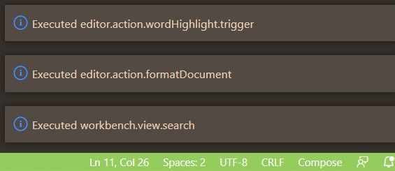

# VSCode Action Tracker

## Summary

Action Tracker is a VSCode Extension that allows You to see what VSCode actions you execute! 
Inspired by JetBrain's Track Actions functionality, this extension will be usefull for anyone who is looking to learn IDE Actions while coding.
Knowing each Action's ID, it is then easy to assign Your own shortcut for it

## Features

When enabled and activated, extension will log Actions IDs via pop-up information messages:\
\

## Requirements

- Action Tracker extension works by analyzing *TRACE level logs* of VSCode's *telemetry*\
To ensure proper exeuction of Action Tracker, _set *Debug log level* to `TRACE`_ 

- Before using Action Tracker, You must provide path to the VSCode's log folder \
Common places on various OS include:
_Windows_: `%APPDATA%\Code\Logs` \
_Mac_: `$HOME/Library/Application Support/Code/Logs` \
_Linux_: `$HOME/.config/Code/Logs` 

## Extension Settings

Action Tracker contributes the following settings:

* `action-tracker.logFolderPath`: Path to VSCode's Log folder
* `maction-tracker.ignoredActions`: A list of actions to ignore. This setting is case insensetive, and does not require a fully-qualified name of a certain action. It is enough to provide substring. Default values for these settings are `"vim", "wordhighlight"`

## Known Issues

Action tracker displays only id of actions, that are logged as `telemetry/*action*`. \
However, not all actions are logged with an action suffix. \
_For example_: if You close an editor by clicking `x` on an editor tab, it will be logged as `telemtry/editorClosed`. 
On the other hand, closing an editor using default `Ctrl-F4` will be logged as `telemetry/editorActionExecuted`. 

This behaviour leads to some actions not being detected by Action Tracker if they are executed in a certain way.
 
It is possible to construct a list of such occurences in the future, but it is not implemented right now. \
If You would like to contirbute for construction of such a list, please, open an issue.
